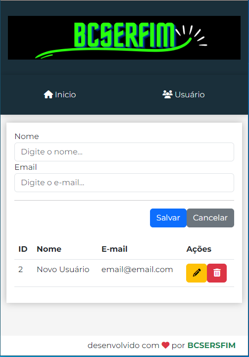
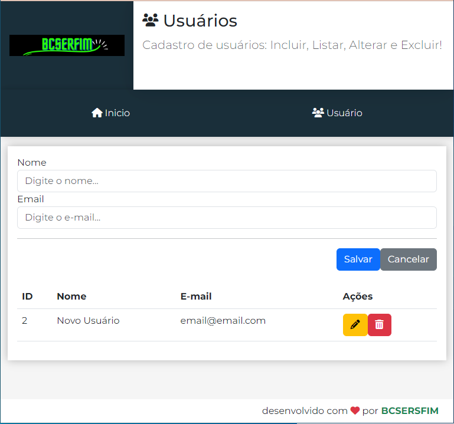
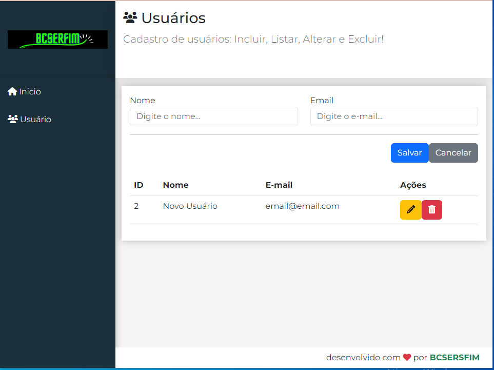

# ReactCrud
Cadastro simples de usuários: Incluir, Listar, Alterar e Excluir

# Projeto de Frontend e Backend em React

Este é um projeto de exemplo que consiste em uma aplicação frontend e backend desenvolvida em React e Node.js, respectivamente. O projeto foi criado para fins de demonstração e aprendizado.

## Tecnologias Utilizadas

### Frontend (React)
- React.js
- Bootstrap
- Font Awesome
- React Router
- Axios

### Backend (Node.js)
- Node.js
- JSON Server

## Sobre o Projeto

Este projeto é dividido em dois componentes principais: o frontend e o backend. Abaixo estão detalhes sobre cada um deles:

### Frontend

A parte frontend do projeto foi desenvolvida em React.js e é responsável por fornecer a interface do usuário. Alguns recursos de responsividade foram criados, segue telas abaixo:

### Para Dispositivos com Tela de 576px

### Para Dispositivos com Tela de 768px

### Para Demais Telas

### Backend

A parte backend do projeto foi desenvolvida em Node.js e usa o JSON Server para simular um servidor RESTful. Alguns detalhes importantes sobre o backend incluem:

- **Arquivo db.json:** Um arquivo JSON que atua como um banco de dados simulado. Ele contém uma coleção de usuários de exemplo.

- **Arquivo package.json (Backend):** Este arquivo de configuração define as dependências e scripts para iniciar o servidor JSON Server.

## Como Executar o Projeto

Para executar o projeto, siga estas etapas:

### Backend (Node.js)

1. Abra o terminal na pasta do backend.

2. Execute o comando `npm install` para instalar as dependências.

3. Execute o comando `npm start` para iniciar o servidor JSON Server.

4. O servidor estará disponível em [http://localhost:3001](http://localhost:3001).

### Frontend (React)

1. Abra o terminal na pasta do frontend.

2. Execute o comando `npm install` para instalar as dependências.

3. Execute o comando `npm start` para iniciar o servidor de desenvolvimento.

4. Acesse a aplicação no seu navegador em [http://localhost:3000](http://localhost:3000).

# Autor
Bruno Cesar Serafim
[Linkedin](https://www.linkedin.com/in/bcserafim)

**Este é um projeto de exemplo e não está destinado a ser usado em produção.**
